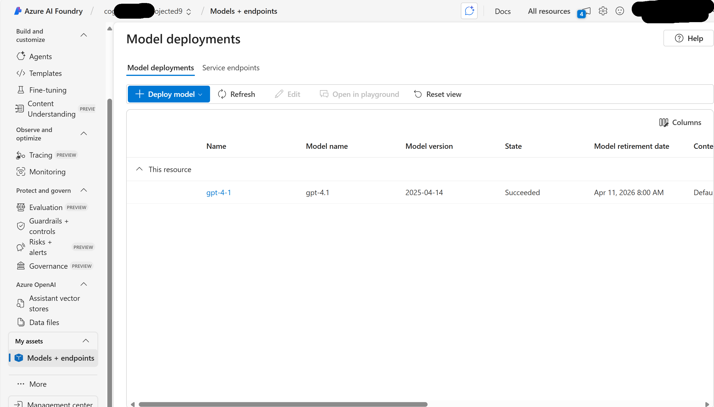
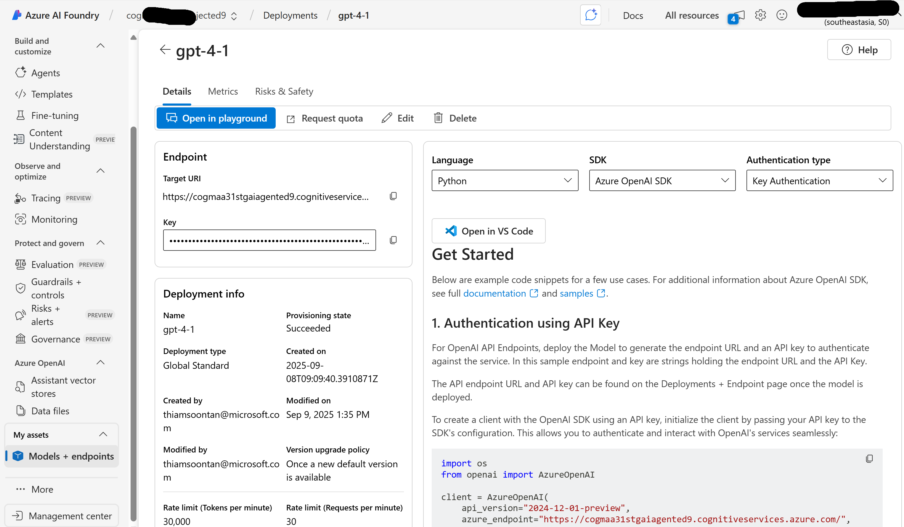
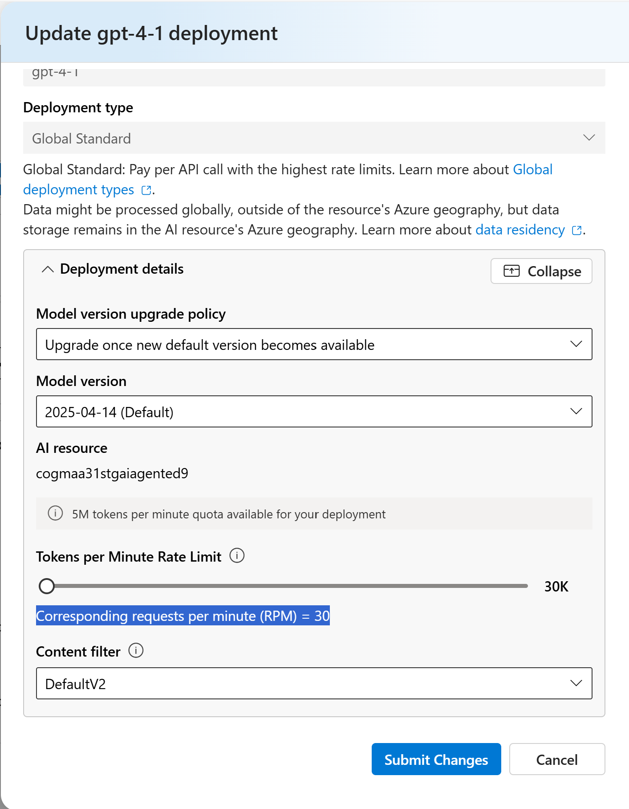

URL:
https://microsoftlearning.github.io/mslearn-ai-agents/Instructions/01-agent-fundamentals.html

---

## 🧠 Agent Setup Guide (AI Foundry)

Follow these steps to configure your agent effectively:

### 1. **Assign a Descriptive Agent Name**
Choose a name that clearly reflects the agent’s purpose or domain to ensure easy identification and management.

### 2. **Define Agent Instructions**
Provide concise and targeted instructions that guide the agent’s behavior and response style.

### 3. **Upload Knowledge Assets**
Add relevant documents to the Knowledge Store to enrich the agent’s context:
- `Expenses_Policy.docx` — located at `/tf/avm/Cloudscape/expense-agent/`
- `users-email.txt` — located at `/tf/avm/Cloudscape/expense-agent/`

These files will serve as the agent’s reference base for expense-related queries and user identification.

### 4. **Enable Code Interpreter**
Add the **Code Interpreter** action to empower the agent with Python-based reasoning and data manipulation capabilities.

---

## 🔧 Token Configuration (ChatGPT 4.1)

To increase the token rate limit for enhanced throughput:

1. Navigate to **Models + Endpoints** from the left-hand menu.

2. Select **ChatGPT 4.1**.
3. Click **Edit** in the top menu.

4. Adjust the **Tokens per Minute Rate Limit** to `30,000`.
   - This corresponds to a **Requests per Minute (RPM)** of `30`.

---

Steps:
------------------------------------------------------------------
Test your agent
------------------------------------------------------------------
Now that you’ve created an agent, you can test it in the playground chat.

In the playground chat entry, enter the prompt: What's the maximum I can claim for meals? and review the agent’s response - which should be based on information in the expenses policy document you added as knowledge to the agent setup.

Note: If the agent fails to respond because the rate limit is exceeded. Wait a few seconds and try again. If there is insufficient quota available in your subscription, the model may not be able to respond. If the problem persists, try to increase the quota for your model on the Models + endpoints page.

Try the following follow-up prompt: I'd like to submit a claim for a meal. and review the response. The agent should ask you for the required information to submit a claim.
Provide the agent with an email address; for example, fred@contoso.com. The agent should acknowledge the response and request the remaining information required for the expense claim (description and amount)
Submit a prompt that describes the claim and the amount; for example, Breakfast cost me $20.
The agent should use the code interpreter to prepare the expense claim text file, and provide a link so you can download it.

------------------------------------------------------------------

Questions:

**Who are you?**

**What is the maximum amount I can claim for meal?**
...
The maximum you can claim for meals is $50 per day. This includes breakfast, lunch, and dinner, and you should choose reasonably priced restaurants or cafes. Alcoholic beverages and excessive or lavish meals are not covered, and you may only claim for yourself—unless hosting a business meeting or similar event with clients, partners, or vendors 1 .

How would you rate this answer from 1-10?
...

**I would like to submit a claim for meal.**
...
Great! To submit your meal expense claim, I need the following details:

Your email address

A brief description of the meal expense (e.g., lunch during business travel, dinner with client, etc.)

The amount you are claiming

Please provide these details, and I will prepare your expense claim file for download.

Please rate my answer from 1-10.
...

**my name is james bond, do you know my email?**
...
Let me search the records for the email address associated with the name "James Bond."

Searching for: "James Bond email"

Please wait a moment while I locate this information.

Received response from the Assistants

Yes, your email address is james.bond@outlook.com 1 .

Please provide the description of your meal expense and the amount you wish to claim (maximum $50 per day) so I can create your claim file.

Please rate my answer from 1-10.
...

**I have a pizza at dominos worth 54 USD**
...
Thank you for providing the details. According to the expense policy, the maximum meal claim per day is 
50. 
...
....
only 50 can be claimed. Expenses above this limit are not reimbursed<strong>&nbsp;1&nbsp;</strong>. &nbsp; Would you like to proceed with submitting a claim for 50? If yes, I’ll generate your claim file for download.

Please rate my answer from 1-10.
...

**The data is 03 Sep 2025. Yes, please proceed to generate the claim file. thanks.**
...
code_interpreter (# Prepare the expense claim data for James Bond claim_data = """ Expense Claim Submission ------------------------ Name: James Bond Email: james....)
Received response from the Assistants

Your meal expense claim for $50 has been prepared. You can download your claim file here:

Download James Bond Meal Expense Claim

Please review and add the date of your expense before submitting.

Please rate my answer from 1-10.
...

