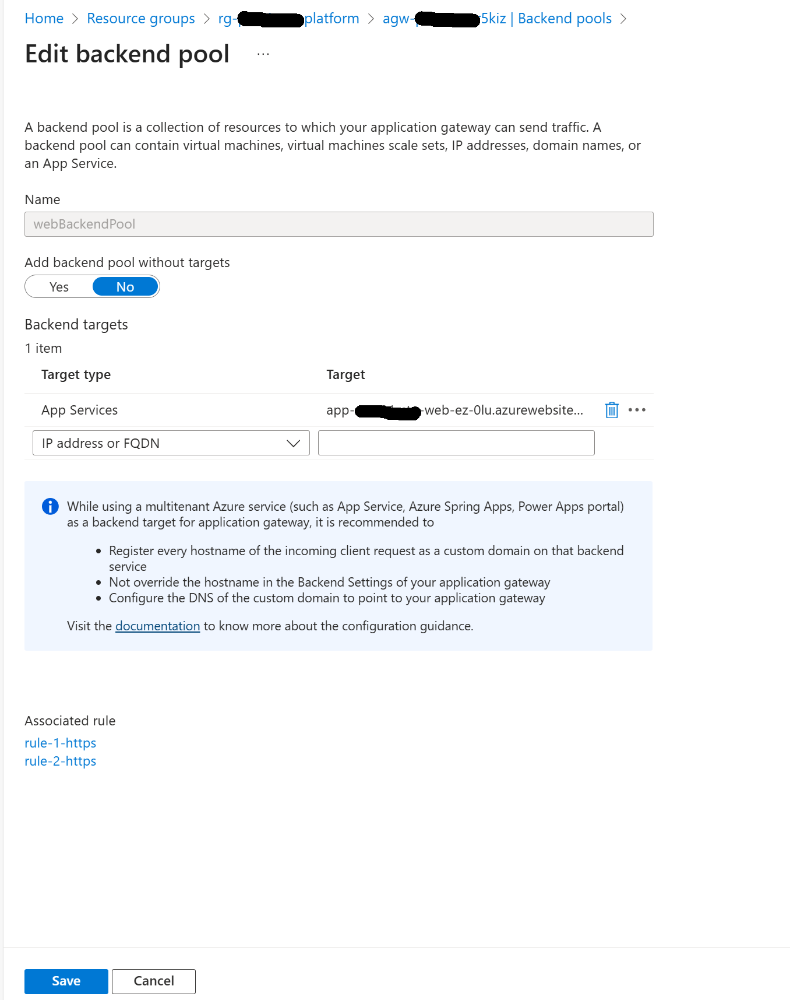
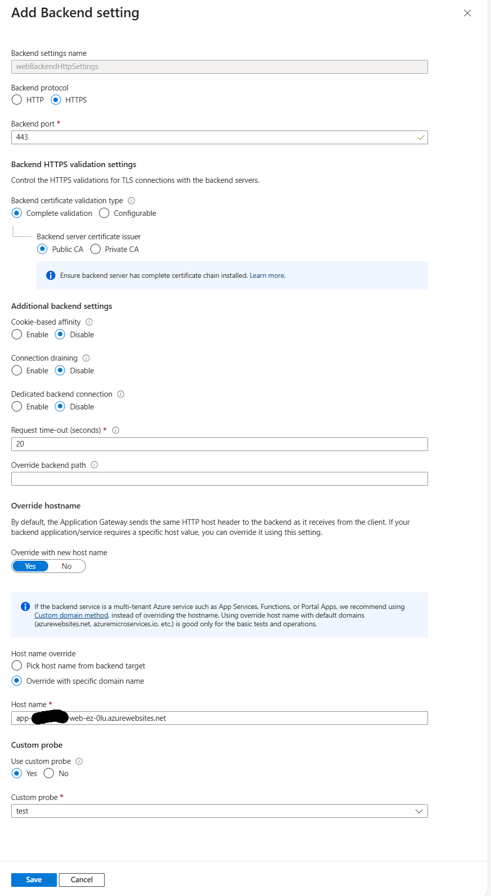
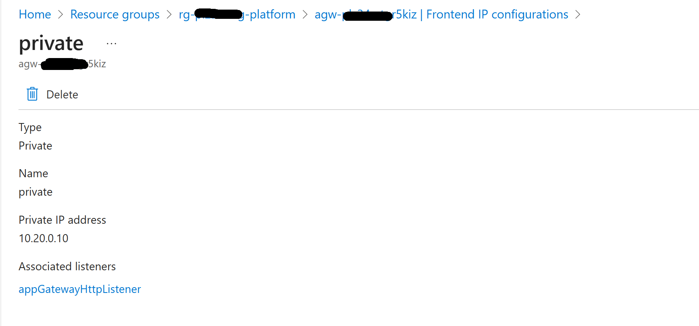
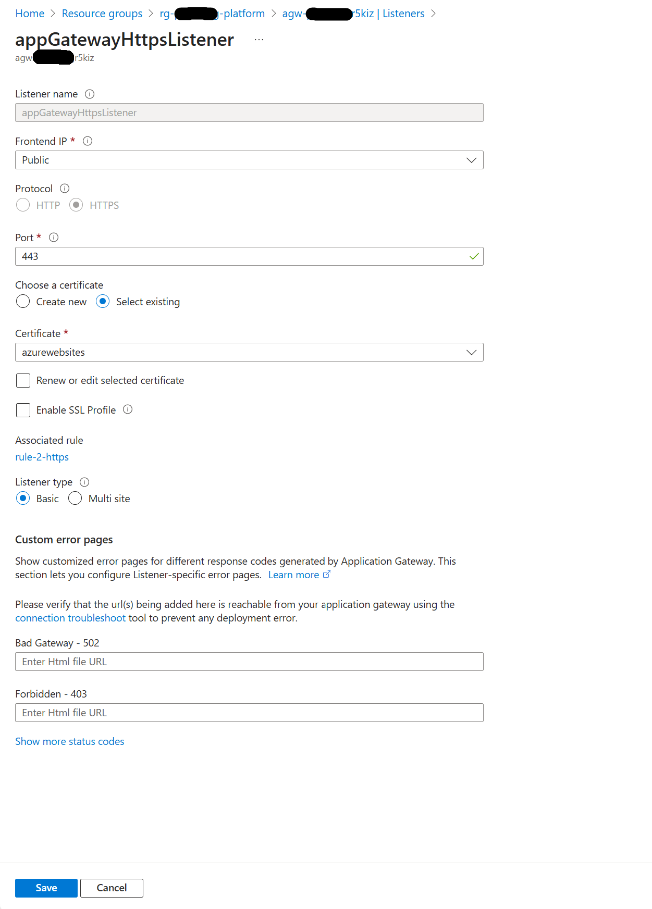
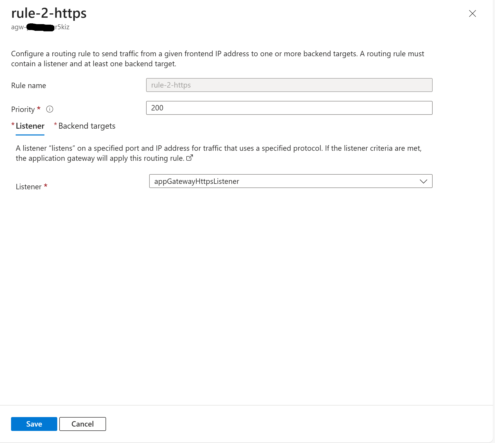
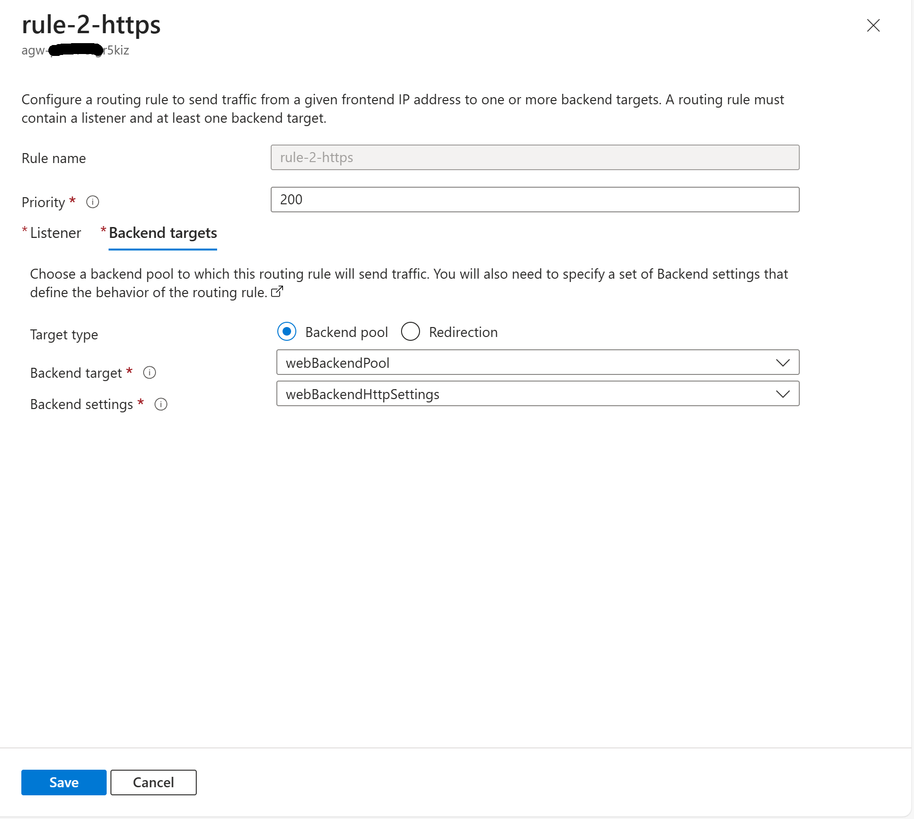
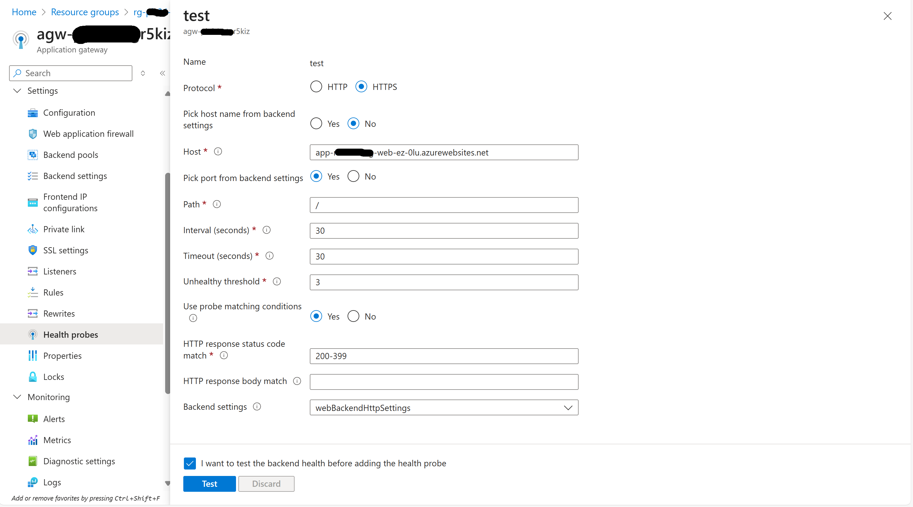
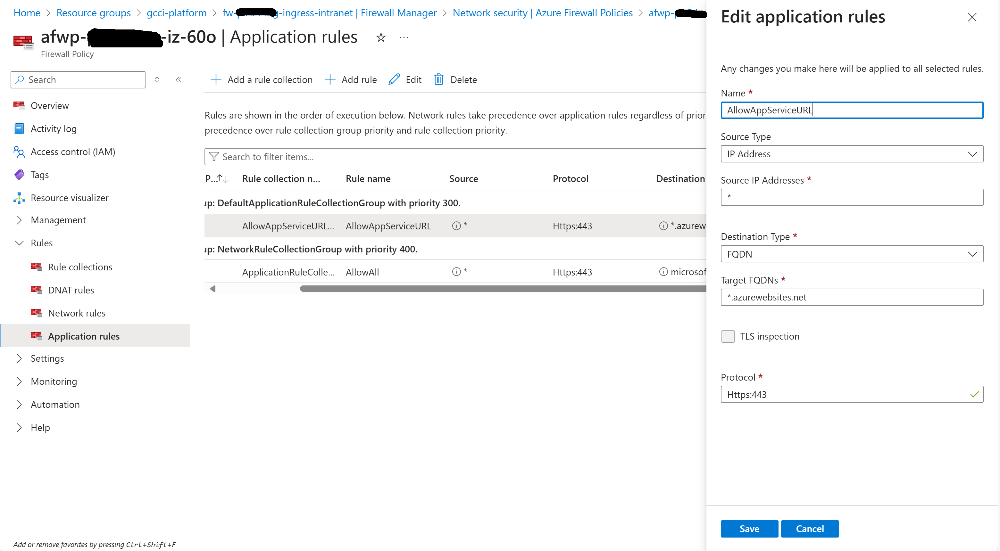
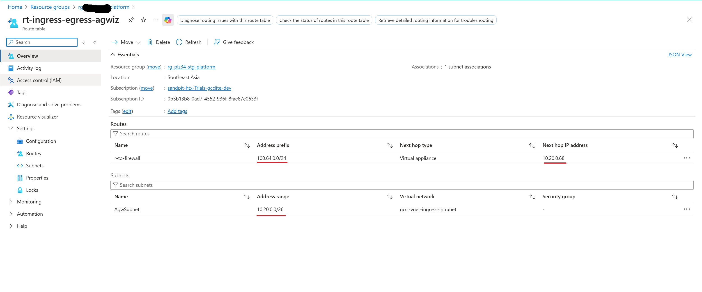

# Application Gateway & Firewall Configuration Guide

This guide walks you through configuring an Application Gateway in Azure Portal.

---

## 1. Configure Backend Pool

**Steps:**
1. In Azure Portal, go to your Application Gateway.
2. Under **Backend pools**, click **Add**.
3. Enter a name for the backend pool.
4. Add backend targets (IP addresses, FQDNs, or NICs of your backend servers).
5. Save the configuration.

---

## 2. Configure Backend Settings

**Steps:**
1. Navigate to **HTTP settings** (sometimes called **Backend settings**).
2. Click **Add**.
3. Specify a name, protocol (HTTP/HTTPS), port, and other settings (cookie-based affinity, connection draining, etc.).
4. If using HTTPS, upload the required certificate if required.
5. IMPORTANT: Ensure **Host name** is entered (same as the URL of the azure app service web app)
6. Save the settings.

---

## 3. Configure Frontend IP Configuration

**Steps:**
1. Go to **Frontend IP configurations**.
2. Click **Add**.
3. Choose **Public** or **Private IP**.
   - For Public IP, select an existing IP or create a new one.
   - For Private IP, specify the subnet and IP address.
4. Save the configuration.

---

## 4. Configure Listener

**Steps:**
1. Go to **Listeners**.
2. Click **Add**.
3. Enter a name for the listener.
4. Select the frontend IP configuration.
5. Choose protocol (HTTP/HTTPS).
   - For HTTPS, select the certificate.
6. Specify the frontend port.
7. Save the listener.

---

## 5. Configure AGW Rules

**Steps:**
1. Go to **Rules**.
2. Click **Add**.
3. Enter a name for the rule.
4. Select the listener, backend pool, and backend settings.
5. Configure path-based or basic routing as needed.
6. Save the rule.

---

## 5. Configure Health Probes

1. Go to **Health probes**.
2. Click **Add**.
3. Enter 
  - Name: test
  - Protocol: HTTPS
  - Host: app-<prefix>-web-ez-xxx.azurewebsites.net <host name of app service>
  - Pick port from backend settings: Yes
  - Path: /
  - Interval (seconds): 30
  - Timeout (seconds): 30
  - Unhealthy threshold: 3
  - Use probe matching conditions: Yes
  - HTTP response status code match: 200-399
  - HTTP response body match: <empty>
  - Backend settings: webBackendHttpSettings
4. Save.

---

This guide walks you through configuring an Firewall Policy Application Rules in Azure Portal.

---
## 1. Configure Firewall Policy Application Rules

1. In Azure Portal, go to your Firewall Policy.
2. Under **Application Rules**, click **Add Rule Collection** or **Add Rule**.
3. Enter 
  - Name: AllowAppServiceURL
  - Source Type: IP Address
  - Source IP Addresses: *
  - Destination Type: FQDN
  - Target FQQDNs: *.azurewebsites.net
  - TLS inspection: Uncheck
  - Protocol: Https:443
4. Save the configuration.

## 2. Add a route table (associate to agwsubnet) to route all traffic from agw to firewall
  - Name: r-agw-to-firewall
  - Address prefix: 100.xxx.x.x/24 <project vnet cidr>
  - Next hop type: VirtualAppliance
  - Next hop IP address: 10.xx.x.xx <fireall private ip>

